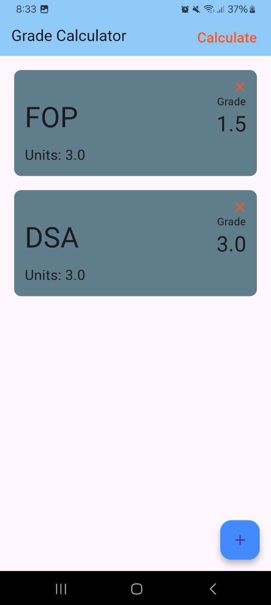

# GWACalc


*(Note: Ensure the filename in `screenshots/` is `ss1.jpg` or adjust the path accordingly.)*

---

## 📚 About GWACalc

GWACalc is a **straightforward and intuitive app** designed to help students easily calculate their **General Weighted Average (GWA)**. No more manual computations or complex spreadsheets!

With GWACalc, you can:

* **Add Subjects:** *Effortlessly input details for each of your courses.*
* **Specify Units & Grades:** For every subject, simply enter its corresponding unit load and the grade you received.
* **Unlimited Entries:** Add as many subjects as you need to cover your entire academic load.
* **Easy Management:** Quickly remove subjects if needed, ensuring your GWA is always accurate and up-to-date.

GWACalc takes the hassle out of tracking your academic performance, giving you a **clear picture of your GWA** with just a few taps.

---

## 🚀 Installation

To install GWACalc on your device, please visit our official installation guide:

[https://example.com/gwacalc-installation](https://example.com/gwacalc-installation)
*(Note: This is a placeholder URL. Please update it with your actual installation guide link.)*

---

## 🛠️ Build Instructions

If you wish to build GWACalc from the source code, follow these steps:

1.  **Clone the Repository:**
    Open your terminal or command prompt and clone the GWACalc repository:
    ```bash
    git clone [https://github.com/OharaDev/GWACalc.git](https://github.com/OharaDev/GWACalc.git)
    ```

2.  **Navigate to the Project Directory:**
    Change your current directory to the cloned project folder:
    ```bash
    cd GWACalc
    ```

3.  **Get Dependencies:**
    Fetch all the necessary Flutter and Dart packages:
    ```bash
    flutter pub get
    ```

4.  **Run the App (Development):**
    Connect a device or start an emulator/simulator, then run the app:
    ```bash
    flutter run
    ```

5.  **Build Release APK (Android):**
    To create a release-ready APK file:
    ```bash
    flutter build apk --release
    ```
    The generated APK will be located in `build/app/outputs/flutter-apk/`.

6.  **Build Release AppBundle (Android - for Play Store):**
    To create an Android App Bundle for publishing to Google Play Store:
    ```bash
    flutter build appbundle --release
    ```
    The generated AAB will be located in `build/app/outputs/bundle/release/`.

7.  **Build iOS Release (Requires macOS and Xcode):**
    To build an iOS release (IPA file), ensure you have Xcode set up and run:
    ```bash
    flutter build ipa --release
    ```
    The generated IPA will be located in `build/ios/archive/`.

---

## 🔑 Credits

**Organization:**
* **OharaDev**

**Developer:**
* **jamir4270**

---